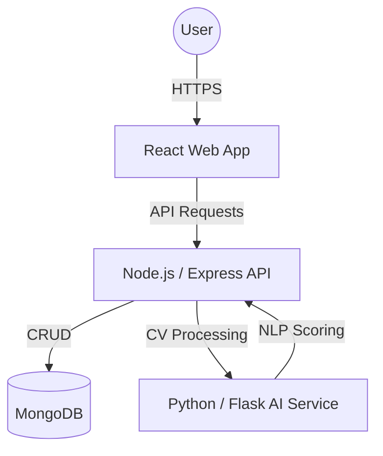

# Tanit-Talent-AI Architecture 🏗️

This document describes the high-level architecture of the Tanit-Talent-AI study project.

## System Overview
The system is built as a three-tier architecture:
1.  **Frontend (React)**: Handles the UI/UX, user authentication state, and communication with the backend.
2.  **Backend (Node.js/Express)**: Serves as the central API gateway. Manages the database, file uploads, and acts as a proxy to the AI service.
3.  **AI Service (Python/Flask)**: Performs heavy Natural Language Processing (NLP) tasks like text extraction and semantic similarity analysis.

## Component Diagram

## AI Logic
The AI service uses the following logic to rank candidates:
1.  **Text Extraction**: PDF files are parsed using `pdfplumber` to extract raw text.
2.  **TF-IDF Vectorization**: Converst text into numerical vectors based on word frequency and importance.
3.  **Cosine Similarity**: Measures the angle between the Job Description vector and the CV vector.
4.  **Ranking**: Scores are normalized between 0 and 1 and mapped to "High", "Medium", or "Low" potential.

## Security
- **JWT**: Stateless authentication using JSON Web Tokens.
- **Middleware**: Role-based access control (RBAC) ensures Candidates cannot access Recruiter dashboards.
- **Bcrypt**: Passwords are salted and hashed before persistence.
